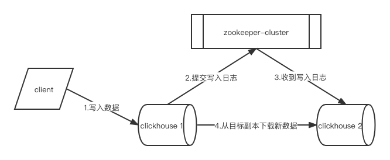
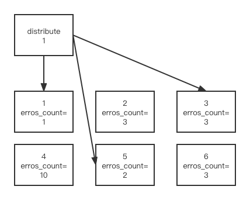

# 副本


1、2两个副本没有主从区分

# 配置步骤
略，未做实验

# 建立副本表

副本只能同步数据，不能同步表结构，我们必须在每台机器上手动建表
```sql
create table a (
    id Uint32,
    sku String,
    create_time Datetime
) engine = ReplicatedMergeTree("/clickhouse/table/01/a", "rep_01")
partiton by toYYYYMMDD(create_time)
primary key (id)
order by (id, sku);
```
对于副本引擎支持整个merge tree家族而言，/clickhouse/table/01/a为zookeeper地址必须统一，rep_01为副本名必须不一样

# 分片集群
副本虽然能够提高数据可用性，降低丢失风险，但是每台服务器实际上必须容纳全量数据，对数据的*横向扩容*(水平扩展)，没有解决
解决数据水平切分，要引入分片概念。通过分片把一份完整数据进行切分，不同分片分布到不同节点上，再通过Distributed表引擎把数据拼接起来一起使用。
Distributed表引擎本身不存储数据，类似mycat->mysql，成为一种中间件，通过分布式逻辑表写入、分发、路由来操作多台节点不同分片的分布式数据。

# 注意
clickhouse的集群是表级别的，实际企业中，大部分做了高可用，但是没有用分片，避免降低查询性能以及操作集群的复杂性。

# 集群

- 优先选择errors_count小的副本
- errors_count相同的有随机、顺序、随机(优先第一顺位)、host名称近似(可以理解为网络拓扑结构相近)等4种选择方式